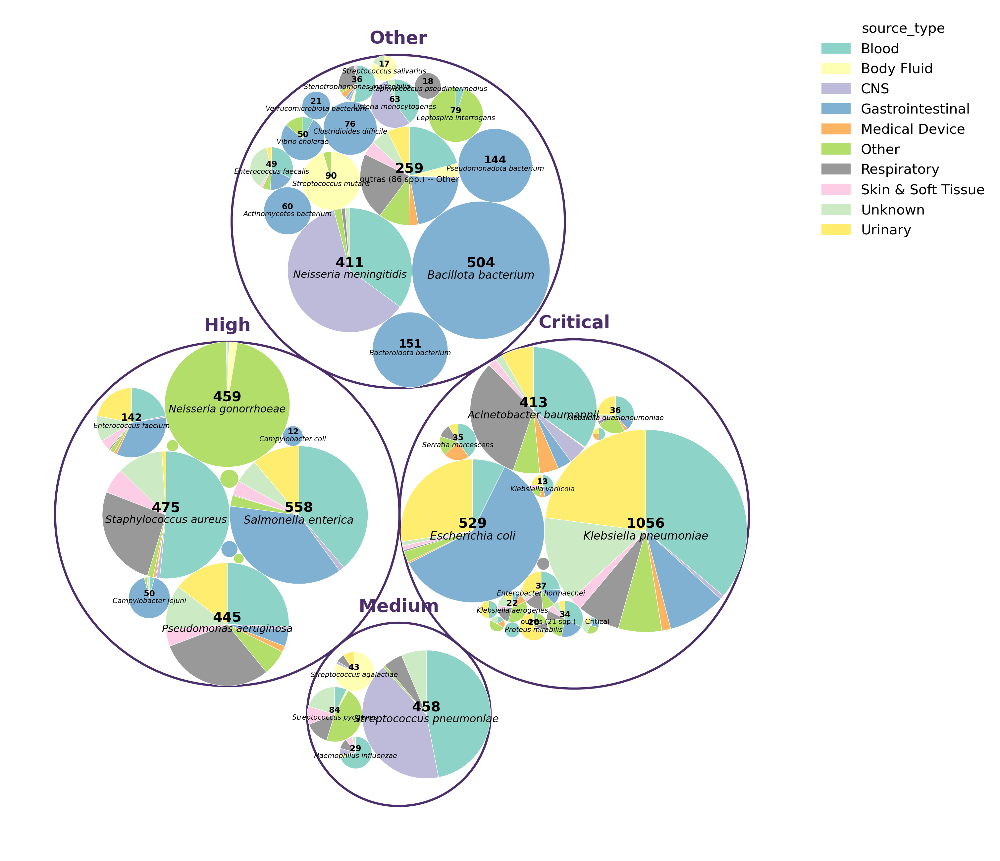

# ml_isolados_brasileiros

Projeto de mestrado: comparação dos resistomas (conjunto de genes de resistência) de isolados clínicos e de genomas bacterianos obtidos de metagenomas ambientais (MAGs), com foco no conceito de "Uma Só Saúde".

## Pré-processamento dos dados

### Obtenção dos genomas
Os genomas bacterianos utilizados neste estudo foram obtidos, em
03/02/2026, a partir de dois repositórios públicos: BV-BRC v3.58.4
(https://www.bv-brc.org) e NCBI Pathogen Detection
(https://www.ncbi.nlm.nih.gov/pathogens). No BV-BRC, foram aplicados os filtros de
origem geográfica (Brasil), hospedeiro humano e classificação de qualidade "good",
resultando em 4.310 genomas. No NCBI Pathogen Detection, foram aplicados os
filtros de origem geográfica (Brasil) e hospedeiro humano, resultando em 6.646
genomas. Após a padronização dos metadados (ano de coleta, espécie e fonte de
isolamento) e remoção de duplicatas (mesmo `Assembly_id`) entre as duas bases, obteve-se um total de
7.068 isolados bacterianos brasileiros únicos.

- **NCBI Datasets** (v18.16.0) - download
- **Prodigal** (v2.6.3) — predição de genes codificadores de proteína
- **RGI** (v6.0.5) — identificação de genes de resistência antimicrobiana, usando o banco de dados CARD (v4.0.1)
- **geNomad** (v1.12.0) — classificação de contigs em cromossomal, plasmidial ou viral, e identificação de elementos genéticos móveis
- **abricate** (v1.4.0) - anotação de genes de virulência com base no banco de dados VFDB (03/04/2026)

### Filtragem de metadados
Em `notebooks/00_ajuste_metadados.ipynb` filtrei e ajustei a tabela de metadados para o final de 7038 genomas, com melhor separação de `source_type` e classificação OMS.

### Obtenção das matrizes
As matrizes de presença/ausência de genes de resistência e as tabelas de anotação são obtidas com o **ARGOS**, biblioteca própria que criei com o intuito de me ajudar a analisar os resistomas, instalada em modo editável (`pip install -e .`) em um ambiente conda. 
No entanto, tinha entendido errado o conceito de classes e métodos em python. Por isso, os notebooks que importam `argos` usam métodos e funções que não podem ser feitas sem esse ambiente.

## Ideia do projeto

### Clusterização

Objetivo: agrupar os genomas (isolados clínicos e, futuramente, MAGs ambientais) em grupos de risco de resistência, a partir de um conjunto de features derivadas do resistoma — sem usar rótulos pré-definidos.

Colunas que pretendo usar na tabela de features:

- `n_genes_cromossomal` — número de genes AMR em contigs cromossomais
- `mdr_score_cromossomal` — número de classes de drogas distintas cobertas pelos genes cromossomais
- `n_genes_plasmidial` — número de genes AMR em contigs plasmidiais
- `mdr_score_plasmidial` — número de classes de drogas distintas cobertas pelos genes plasmidiais
- `pct_contigs_cromossomal` / `pct_contigs_plasmidial` — percentual de contigs de cada tipo
- `pct_plasmidial_amr` — percentual de contigs plasmidiais com pelo menos um gene AMR
- `pct_plasmidial_conjugacao_amr` — percentual de contigs plasmidiais com AMR e maquinaria de conjugação simultaneamente
- `n_genes_plasmidial_conjugativo` — genes AMR em plasmídeos conjugativos (indicador de mobilidade)
- `n_plasmidial_<classe_de_droga>` — matriz de contagem de genes plasmidiais por classe de droga (ex.: `n_plasmidial_beta-lactam`)
- `vfdb_<>` — matriz de contagem de genes de virulência por classe (ex.: `vfdb_adherence`, `vfdb_biofilm`)
- `tem_plasmidio` — flag indicando se o genoma tem pelo menos um contig plasmidial
- `gc_diff_plasmid_cromossomo` — diferença de %GC entre contigs plasmidiais e cromossomais
- `tnf_divergence_plasmid_cromossomo` — divergência de frequência de tetranucleotídeos (TNF) entre contigs plasmidiais e cromossomais

A ideia central é que o agrupamento não precisa — e talvez não deva — coincidir com o **WHO_Priority**: a lista de patógenos prioritários da Organização Mundial da Saúde, que classifica *espécies* bacterianas inteiras em níveis de prioridade (Critical / High / Medium) para orientar pesquisa e desenvolvimento de novos antibióticos. Essa classificação é feita por espécie, mas dentro de uma mesma espécie o perfil de resistência de cada isolado pode variar bastante — nem toda *E. coli*, por exemplo, carrega o mesmo nível de resistência. Além disso, WHO_Priority não é aplicável a MAGs ambientais (que muitas vezes nem têm identificação confiável de espécie), o que inviabiliza a comparação direta entre isolados clínicos e metagenomas se o alvo for baseado em espécie. O broblema do meu projeto era que ao reduzir a dimensionalidade da tabela de genes com PCoA, o número desigual de genomas por espécie e o padrão do genoma core inviezam a análise, então foi sugerido na banca de acompanhamento tentar remover esse efeito de espécie.

### Classificação

Classificar os genomas segundo o alvo definido pela clusterização acima (prever o grupo de risco um genoma pertence, a partir das mesmas features).

### Regressão

Ainda não decidi.
